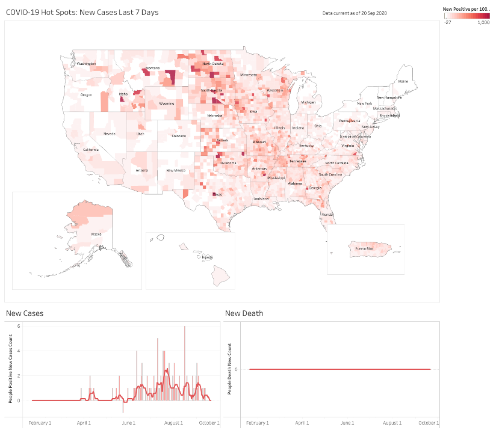
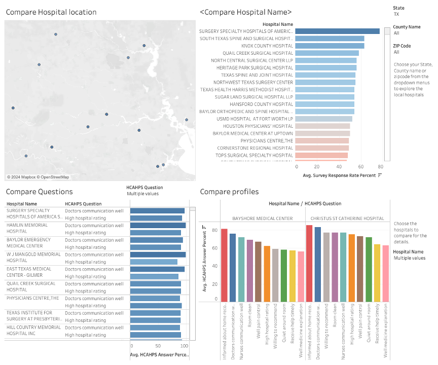
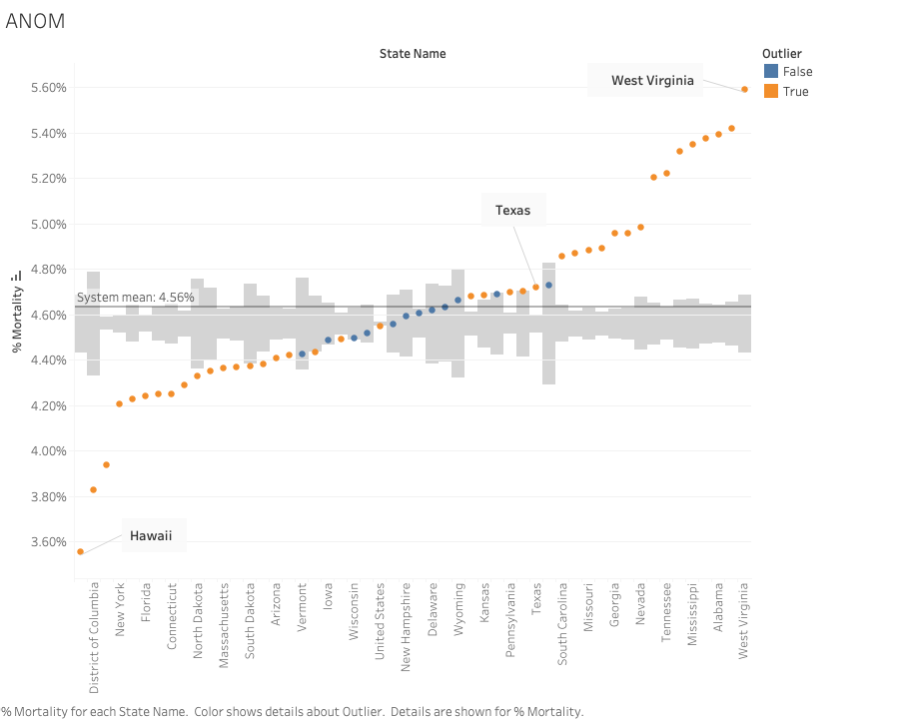
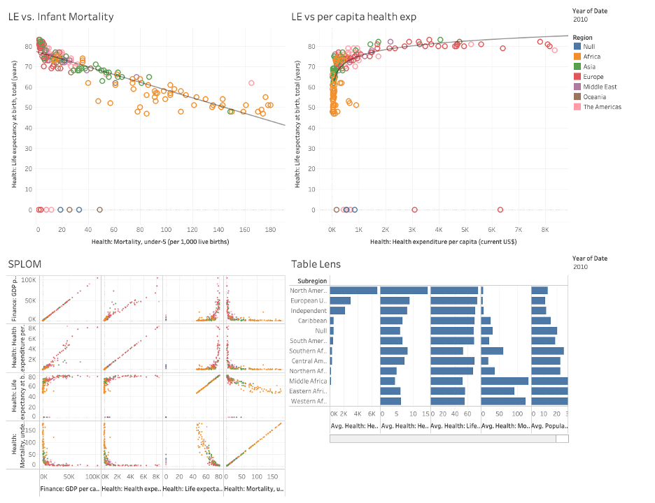

# tableau-viz

## Overview
The four projects all involves analyzing health data to identify trends and opportunities for optimization using Tableau.

## Interactive Version
You can view the interactive version of some of the Tableau workbooks:
- [COVID-19 Hot Spots](https://public.tableau.com/views/COVID-19DashboardforClassHomework_17237724319710/COVID-19spots?:language=en-US&:sid=&:redirect=auth&:display_count=n&:origin=viz_share_link)
- [World Population Bank Analysis](https://public.tableau.com/views/Unit13-VB/Dashboard1?:language=en-US&:sid=&:redirect=auth&:display_count=n&:origin=viz_share_link)
- [ANOM](https://public.tableau.com/views/unit12-VB/ANOM?:language=en-US&:sid=&:redirect=auth&:display_count=n&:origin=viz_share_link)

## Visualizations

*COVID-19 Hot Spots.*

*Hospital Analysis.*

*ANOM MD Prescribing Data Analysis.*

*World Population Bank Analysis.*

## Files
- `workbook/.twbx`: The Tableau Packaged Workbook files.
- `screenshots/.png`: The screenshots for the Workbook files.

## Tools Used
- Tableau
- SQL
- Python (for data preprocessing)
